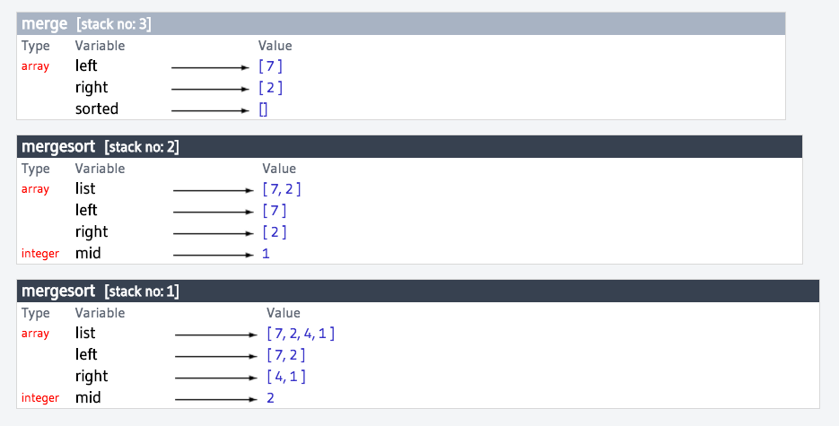
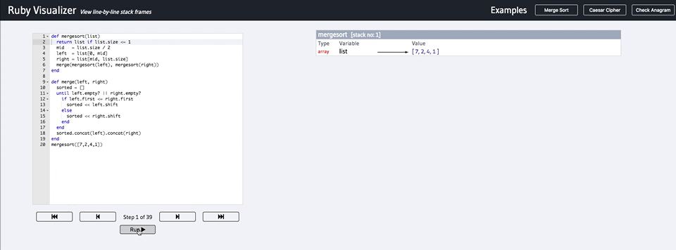
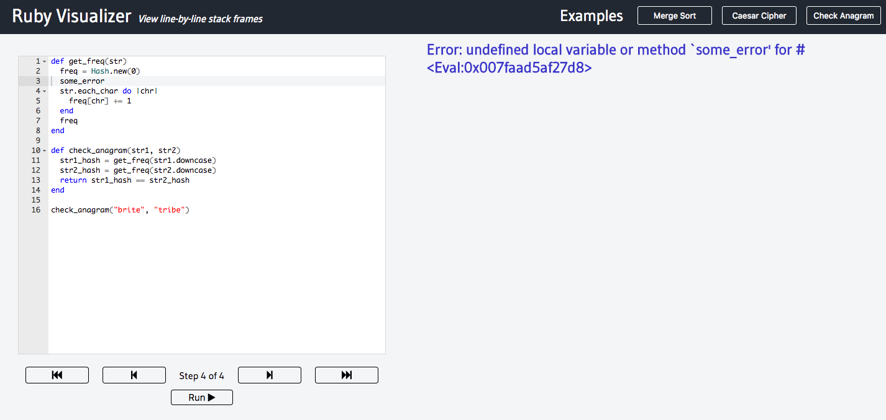
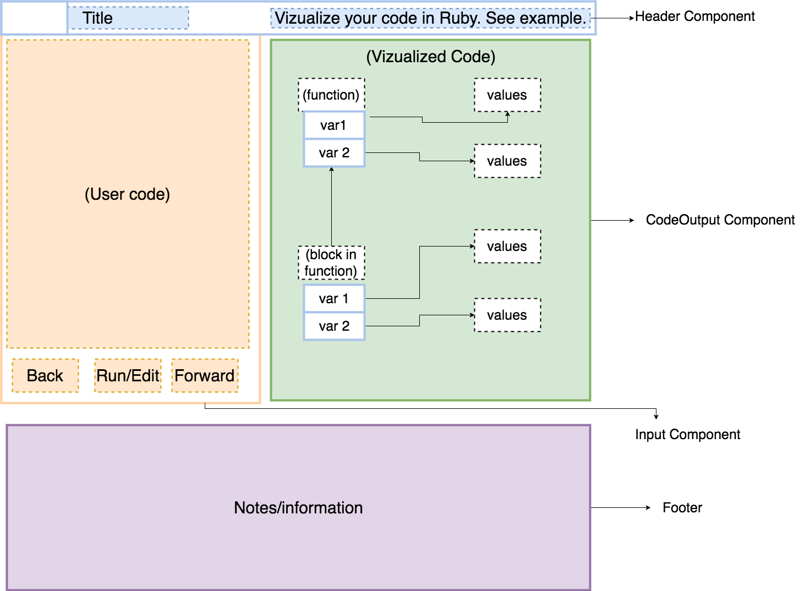

## Ruby Visualizer

### Background

Ruby Visualizer is a educational tool to help ruby beginners visualize what their code is doing at each line. We were inspired by tools such as [Python Tutor](http://www.pythontutor.com/) which were extremely helpful when we were trying to learn how to code. We wanted to contribute a similar tool geared towards the Ruby community that would be simpler to digest.

Live Site: [Ruby Visualizer](http://www.rubyvisualizer.com)

Created by: Audrey Mefford & Bryant Luong

### Features

#### Recursive Stack Display



Displays all active stack frames for nested methods.

#### Code highlighting



Implement active line highlighting for code being evaluated.

#### Error checker and display



Display error description and highlight line of code where error occurs.

### Technologies

+ Vue.js / Vuex
+ Ruby on Rails
+ Tracepoint / Binding_of_caller
+ Webpack / Babel / Yarn
+ Ace Editor
+ Axios

Ruby Visualizer is single page application built using **Vue** for the frontend with a **Vuex** architecture to manage data flow. **Rails** is implemented in the backend to receive data and run evaluators for user provided code. Users input code through a Vue component, which passes a JSON object to Rails via an **Axios** request. The code is received by our `InputsController` to be evaluated.

```ruby
def trace
  block_lines = getBlockLineNumbers
  tracer = TracePoint.new(:line) do |tp|
    @stack_history_counter += 1
    if @stack_history_counter < 3000
      if block_lines.any? { |x,y| tp.lineno.between?(x,y)}
        retrieve_variables(tp.lineno, true)
      else
        retrieve_variables(tp.lineno)
      end
    else
      @stack_history.push({ errors: "Error: stack frames exceeded" })
      break
    end
  end
```

The evaluator utilizes Ruby's builtin **Tracepoint** class to define callbacks for each line of code that is evaluated at runtime.

```ruby
until get_method_name(count) == "evaluate"
  @stack_history_counter += 1
  count += 1 if get_method_name(count) == "step"
  if is_block
    function_obj = get_function_variables(block_method, count+1)
    block_method = true
  else
    block_method = true
    function_obj = get_function_variables(block_method, count+1)
  end
  stack_frame.push(function_obj)
  count += 1
end
@stack_history.push( { "lineno#{lineno}" => stack_frame.stack_store } )
```

At each line, we toss the code into our `retrieve_variables` method to obtain local variables, stack frames, and state information. `binding.of_caller` is used to obtain all variables and all variable values for each stack frame until it reaches our `evaluate` method.

```ruby
binding.of_caller(count).eval('local_variables').each do |var|
  curr_var = binding.of_caller(count+1).eval(var.to_s)
  if curr_var.is_a?(Array) || curr_var.is_a?(Hash) || curr_var.is_a?(String)
    methodObj[var] = binding.of_caller(count+1).eval(var.to_s).deep_dup
  else
    if curr_var.is_a?(Symbol)
      curr_var = curr_var.to_s + 'SYM'
    end
    methodObj[var] = curr_var
  end
end
```

The series of frames, accompanied by variable information and method name, is stored as a snapshot in our `stack_history`. The `stack_history` will be put into a JSON object and passed back to our **Vue** store. The store will pass this information to our Vue components to be parsed and visualized by data type.

```html
<li v-for='arr in arrays'>
  <ArrayType :array='arr'></ArrayType>
</li>
<li v-for='hash in hashes'>
  <HashType :hash='hash'></HashType>
</li>
<li v-for='other in otherTypes'>
  <OtherType :other='other'></OtherType>
</li>
```

### Wireframe



## Future Implementation
#### Print statements
Add a print log that will display print, puts, and p statement functions that user provides.
#### Class visualization
Add class types and obtain global variable information to display detailed information for each Class object.
#### Code runtime statistics
Add code runtime statistics to provide information on the efficiency of code provided.
